# FAQ Bot
A sample FAQ bot for Workplace which can act as an online assistant answering questions it is asked by simply querying from a google sheet. 

What can the bot be used for ? 

* FAQ Bot : Bot that answers frequently asked questions for any product/feature/process
* HR Bot : Common asked questions about organisation/company for employees 
* Acronym Bot : Can be used as a simple acronym bot used by noobs to help understand the meanings for multiple acronyms or terms used in the company
* You can also extend this to add other spreadsheet services such as office 365

How does it work ? 

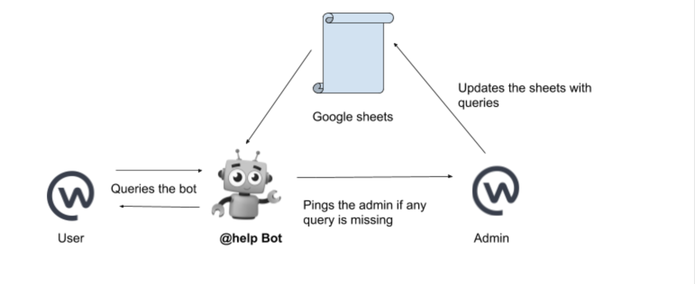

* Workplace Admin updates the google sheet with all the necessary information. The sheet can be accessed and updated by anyone with the correct permission as assigned by the organisation (irrespective of their work background)
* Workplace user queries the bot(FAQ bot) for information about any specific topic
* FAQ Bot  queries the sheets and replies back to the user
* In case a query made to the bot is absent in the sheets then the FAQ Bot pings the admin with the unavailable query to update the sheet

* You can check the experience of the bot in this video :

How to deploy FAQ Bot to your workplace?

We can split the process to three major steps

* Google Sheet Setup
* Development/Deployment of Code
* Workplace Admin Setup

 Google Sheets API Setup 

As the bot refers to the spreadsheet to get the answers for the queries it gets , it is very important to configure the google spreadsheet (https://www.google.com/sheets/about/)
To programmatically access(which the Bot will do) your spreadsheet, you’ll need to create a service account and OAuth2 credentials from the Google API Console (https://console.developers.google.com/)

* *Go to the Google APIs Console (https://console.developers.google.com/)*
* *Create a new project*

* *Click Enable API. Search for and enable the Google Drive API.*

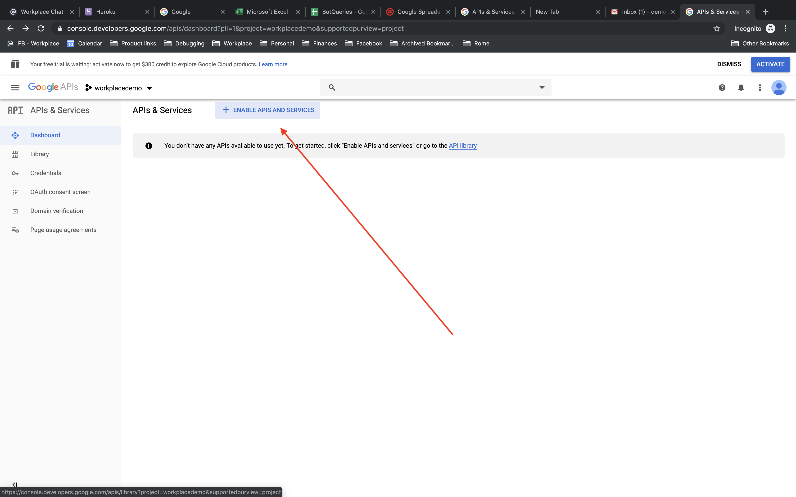

* *Create credentials for a Web Server to access Application Data.*

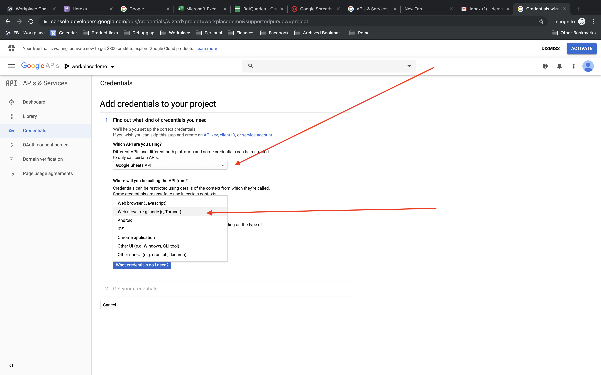

* *Name the service account and grant it a Project Role of Editor.*

* *Download the JSON file.*

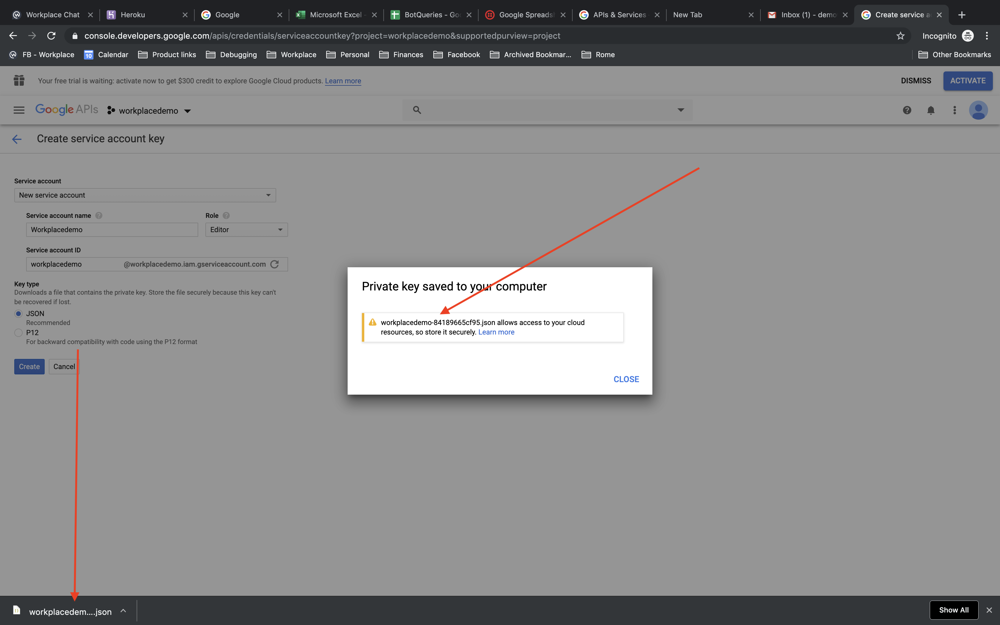

* *Copy the JSON file to your code directory and rename it to client_secret.json*
* *Create a new google sheet and enter the queries/answers*

* Index* - # of items in the sheet 
* Tag - *Quick/easy look up for the user queries 
* FAQ Question - * User queries for Bot
* meaning/def/more - *Detailed answer for each query received 

* *Find the client_email inside client_secret.json. Back in your spreadsheet, click the Share button in the top right, and paste the client email into the People field to give it edit rights. Hit Send.*

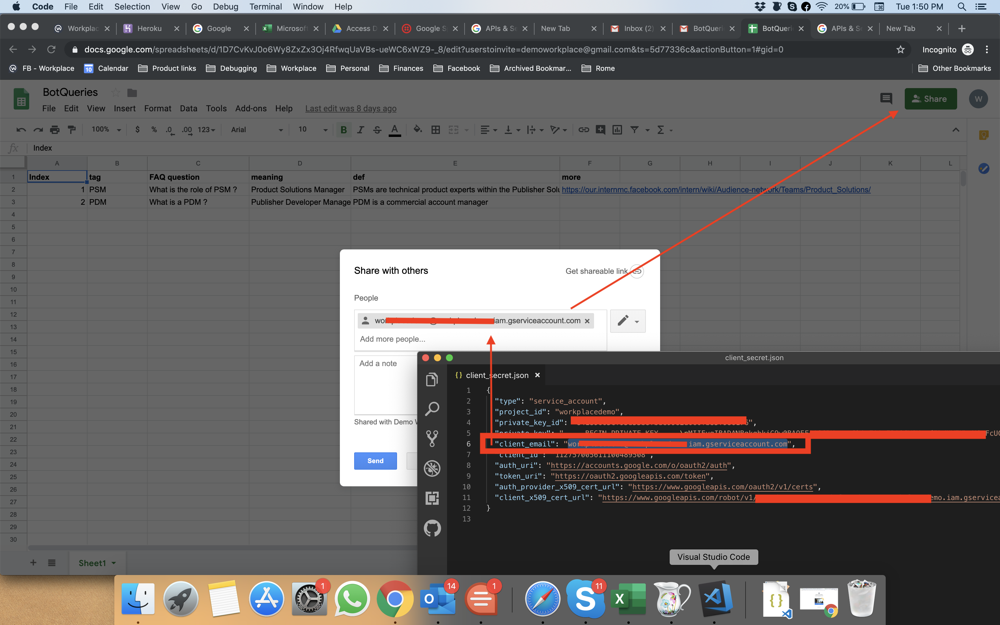

Deployment/Code setup

* Please ensure you have the following setup at your end to run the webhook code at your end 
    * You need to run the code in a server : Unix/Linux/Mac OS X 
    * Download node installer to install node and npm (node package manager)[https://nodejs.org/en/]
    * Install any IDE of your choice to check the code and edit anything required 

* The project has 3 files which we needs to be modified/changed according to your needs 
    * *client_secret.json(FAQ/utilities/client_secret.json)[*Mandatory*]*
        * You need to replace the client_secret.json in the project with the one that you saved in the previous step
    * *.env(FAQ/.env)[*Mandatory*]* 
        * Please modify/add the necessary details to this file
        * This is your config file which can be edited at any point of time 
        * It contains the google sheet ID/ google sheet links and Workplace_Admin_ID
        * ["Google_sheet_bot_queries","Google_sheet_new_queries"]These spreadsheet ID are the long keys in the two Google sheet URLs
        https://docs.google.com/spreadsheets/d/[ Google sheet ID]/edit#gid=0
        * The workplace Admin ID can be copied from the URL of the Workplace Admin Profile page : https://my.workplace.com/profile.php?id=[Profile ID Number]
        * "Google_sheet_bot_queries_link" , "Google_sheet_new_queries_link " : are the complete google sheets link urls from which the bot would be reading the data 
Google_sheet_bot_queries_link =    https://docs.google.com/spreadsheets/d/[ Google_Bot_Queries_Sheet_ID]/edit#gid=0
Google_sheet_new_queries_link =    https://docs.google.com/spreadsheets/d/[Google_New_Queries_Sheet_ID]/edit#gid=0
        
        
        
    * *messages.js (FAQ/utilities/messages.js)[*OPTIONAL*]*
        * Most Important : Make sure to get the columns names right from the spreadsheet set up 

e.g. in here the column names (“meaning”,“def”) is same as the ones being extracted in the code

 
 
        
        * You can add your own welcome message 

 

        * Add the necessary - User friendliness checks 

 

        * Add your own custom admin message in case any query from the sender is not found 
* After making the changes you can deploy the code in your server 
* PLEASE NOTE : The Webhook should be hosted in a server which is under your control to comply with workplace platform policies. Hosting the code in any 3rd party/Partner server could be flagged for non-compliance.
* If you want to test the feature on your end , you can use Heroku (which gives a free account) to host the webhook. [It should not be used for Production instances]
* In this example I have used Heroku to deploy my code and make all the configurations 
    * You can create a new app in Heroku
    

 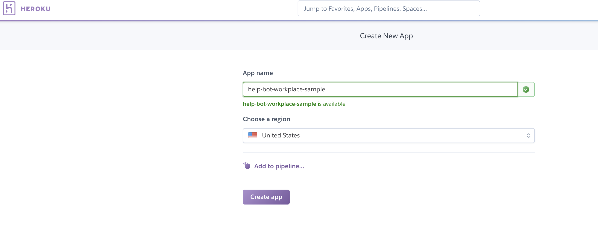

* As my code is pushed to Github, i am choosing github account project 

 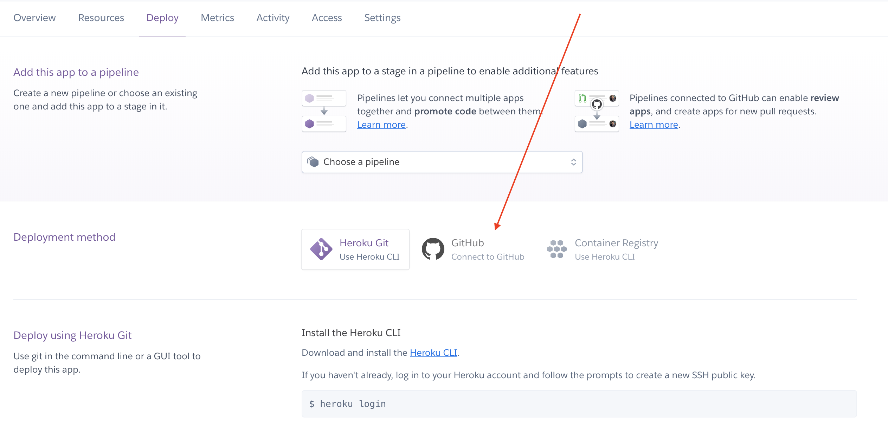

* Make sure you “Enable Automatic Deploys” after deploying branch

 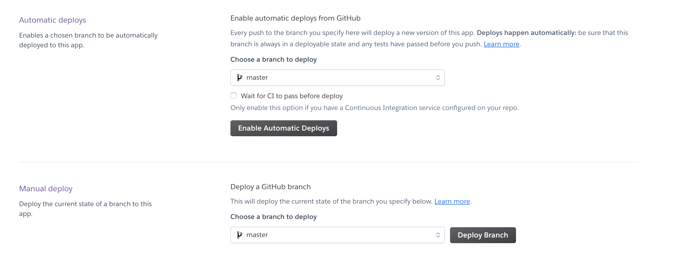

* There is one final step that you need to do which we will complete after the Workplace Setup 

Workplace Admin Setup

* Admin needs to create a custom integration in the Admin Panel of workplace account

 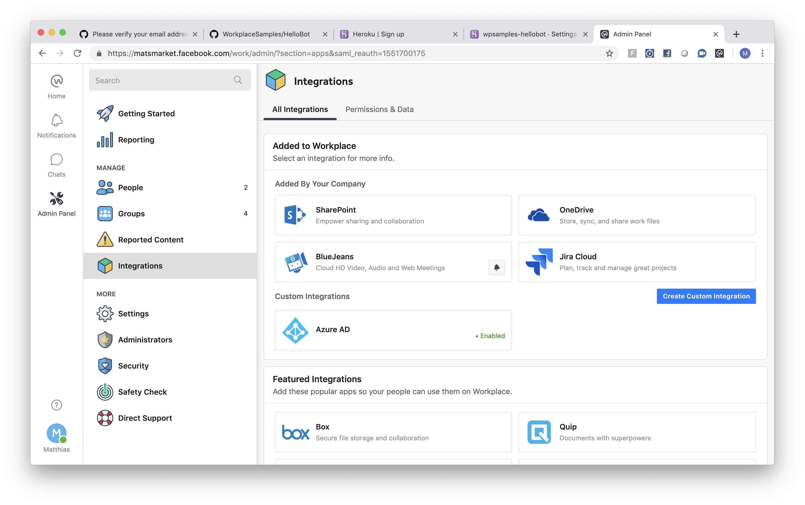

*   Click on the “Create custom integration” button

 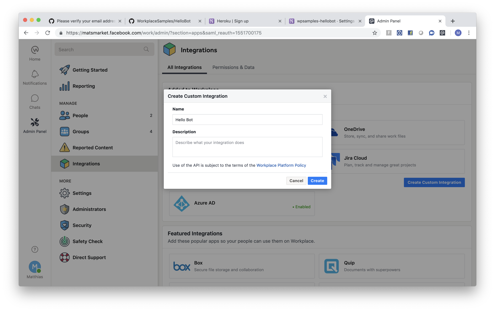

*  Enter a name for the integration, which will be the name of your chat bot, and click on the “Create” button. You will now be able to configure the permissions of the integration. Enable the “Message any member” permission and click on the “Create access token” button.

 
 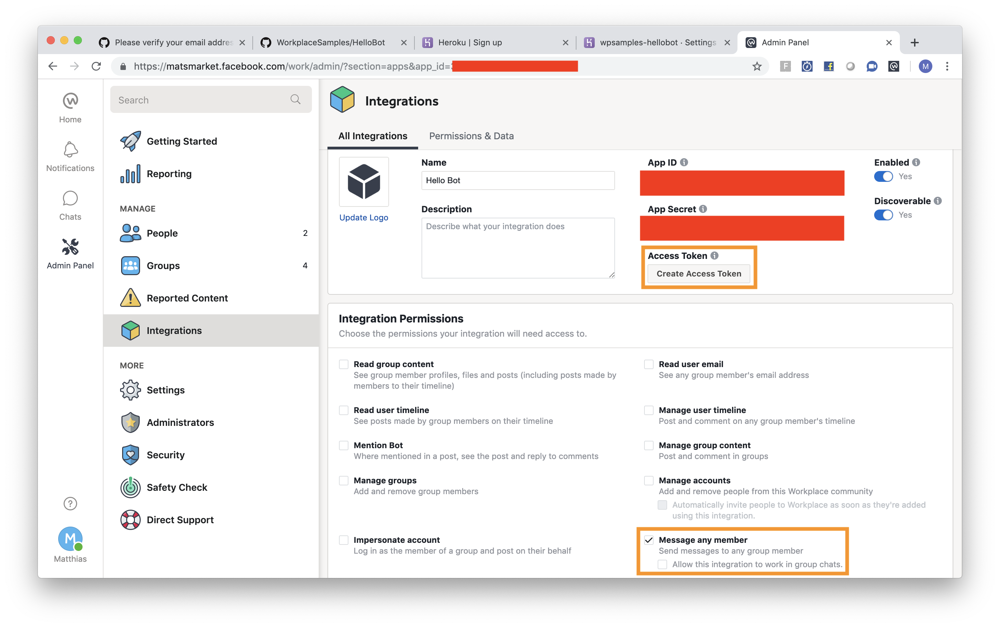
 

*  Copy the access token, enable the “I understand” checkbox and click on the “Done” button

 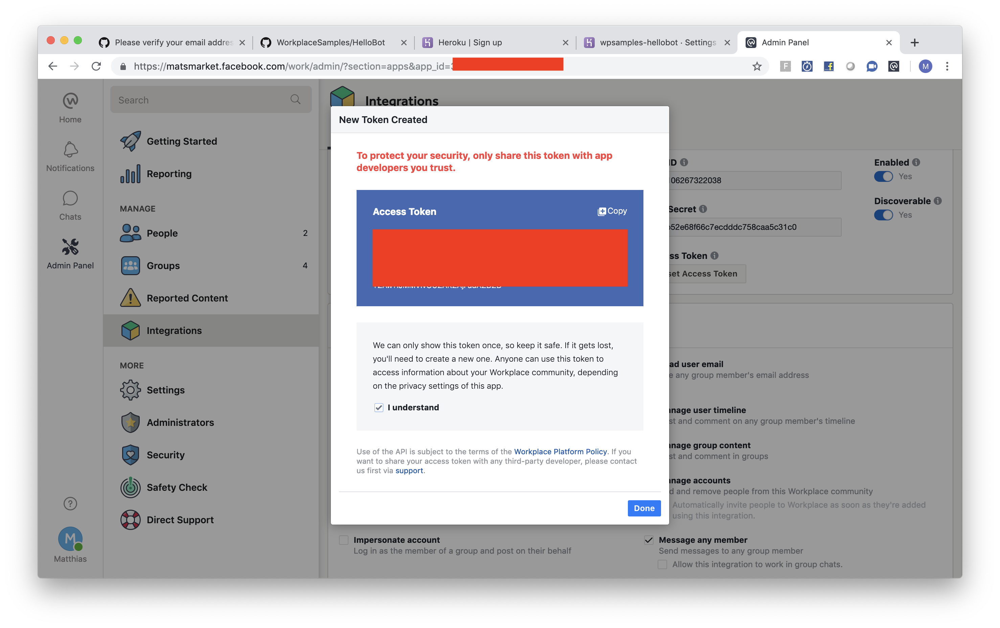

Configuring Values for Workplace and Heroku

 

*  Return to the settings page of the Heroku application and paste the access token that you've just copied in the ACCESS_TOKEN value.
* Copy the App ID and App Secret of the Workplace integration and paste it in the APP_ID and APP_SECRET values
     Return to the integration configuration in Workplace and scroll all the way down until you see the configure webhooks section. Enable the “messages” checkbox and specify the following fields:
    
* Callback URL: https://[name of your Heroku application].herokuapp.com/webhook (https://herokuapplicationname.herokuapp.com/webhook)
    * The name of the Heroku application can be found by clicking on the “Open app” button in the Heroku application. This will then open a new tab where the name of the application will be the first part of the url (e.g. https://wp-helpbot.herokuapp.com/ (https://wpsamples-hellobot.herokuapp.com/) will become https://wp-helpbot.herokuapp.com/webhook)
    * Verify Token: [Enter a token of your choice]
    *  Return to the Heroku settings page and fill out the remaining values as followed
        
    * SERVER_URL: https://[name of your Heroku application].herokuapp.com/ (https://herokuapplicationname.herokuapp.com/webhook)
    * VERIFY_TOKEN: [Enter the same token specified above]

*  Return to the integration configuration in Workplace, scroll all the way down and click on the “Save” button.
     When you click on the “Save” button, you should return to the main custom integrations page
     
* When you open app in Heroku, you might see an application error on your screen. Please ignore that and click on "View logs" under the more button , that shwos you the status of the application.
  
 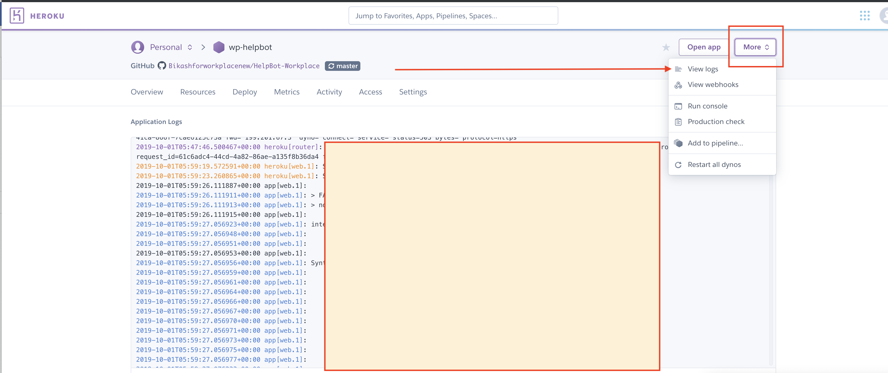
    
* Verify that the Workplace Chat bot is working

